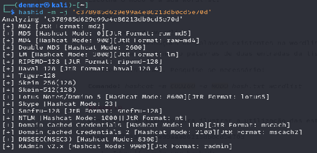
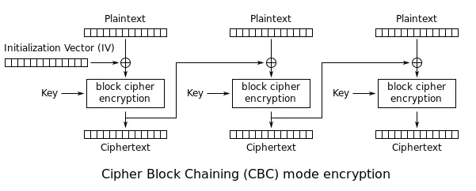
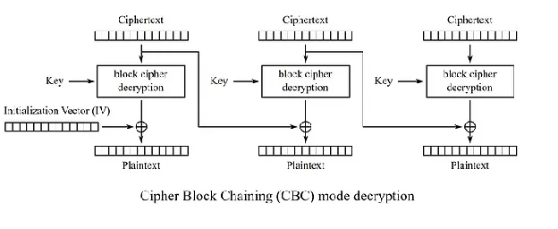

Estratégias para a resolução de CTF's

# CRIPTOGRAFIA

# Descrição

Criptografia é uma estratégia de segurança que envolve codificar dados através de uma função para que somente pessoas permitidas possam entender os dados originais. Um exemplo bobo de criptografia é transformar o alfabeto em números, em uma relação na qual A -> 1, B -> 2, …

# Principais casos de uso em CTF

Em CTF’s, as principais aparições de criptografia são relacionadas à senhas, mensagens e arquivos. Você se depara com um texto estranho totalmente ilegível mas que contém informações relevantes para o seu avanço, como:

    user: admin
    pass: fc8252c8dc55839967c58b9ad755a59b61b67c13227ddae4bd3f78a38bf394f7

Usualmente nos deparamos com dois tipos de funções, as reversíveis e as irreversíveis.

* **Reversíveis:** São usadas para comunicação, onde o remetente codifica sua mensagem de forma que apenas o destinatário consiga reverter a codificação.  
* **Irreversíveis:** São usadas principalmente para senhas, onde não há necessidade nem intenção de reverter. Nesse caso a verificação é feita a partir da comparação, a senha que você informa é criptografada e é comparada com a hash da senha esperada.

# Técnicas de Criptografia

* **Salt:** é uma estratégia de adicionar uma string, geralmente um hash aleatório, ao valor que será criptografado, dessa forma, mesmo com ataques bruteforce não seria possível obter o valor original sem essa parte adicional, o salt.
* **Rehashing:** é uma técnica recursiva que envolve encriptar a entrada uma série de vezes, podendo usar, ou não, salt durante as diferentes encriptações.

# Estratégias

1. [Identificação do tipo de criptografia;](#identificação-do-tipo-de-criptografia)

2. [Quebra da função de encriptação;](#quebra-da-criptografia) 

## **Identificação do tipo de criptografia** {#identificação-do-tipo-de-criptografia}

Antes de tudo, identificar o tipo de criptografia que está sendo usado é essencial!

### Reversível

* A criptografia é usada em contexto de comunicações  .
* O valor codificado ignora acentos e caracteres especiais, de forma a manter o formato visual do texto original  
* **Deve-se procurar a chave/função de criptografia utilizada**, o ambiente provavelmente fornecerá informações sobre onde procurar  .
* Utilize o Google e o Chat GPT para auxiliar com as informações que você tem disponíveis e o contexto para encontrar a função de decrypt.

### Irreversível

* O valor é uma senha de usuário.
* Se a hash estiver dentro de um arquivo de configuração ou é utilizada em um sistema específico como um painel de administrador, procure informações na documentação ou Google da função que é utilizada.

### Ferramentas

* **hash-identifier**: está disponível no kali e não necessita de parâmetros. 
* [CyberChef](https://gchq.github.io/CyberChef/#recipe=Analyse_hash\(\)&input=): online, boa alternativa para segunda opinião.
* **hashid**: Muito útil pois é nativa do kali e retorna o código para uso das principais ferramentas de quebra: Hashcat e John The Ripper.
  **Uso**: `hashid \-m \-j 'hash'`

## **Quebra da Criptografia** {#quebra-da-criptografia}

De acordo com o cenário envolvido na etapa de identificação utilize as ferramentas e procedimentos para a quebra e obtenção das informações originais.

Para estratégias reversíveis geralmente são procedimentos manuais para reverter as operações, por exemplo:

    def encryption(msg):
    	ct = []
    	for char in msg:
    		ct.append((123 \* char \+18\) % 256\)
    	return bytes(ct)

Essa função espera ser descriptografada do outro lado, portanto existe uma maneira de descriptografar, mas observe que existe a função resto, o que exigirá certo esforço para reverter as operações matemáticas. Recomendo que façam esse desafio: Baby Encryption.

# Crackstation

Você provavelmente quer resolver este problema o mais rápido possível e não tentar todas as trilhões de combinações. Este é um site que auxilia muito no processo de quebra de senhas fracas. Teste-o primeiro que todas as demais alternativas devido a sua simplicidade e facilidade.

[Acesse aqui!](https://crackstation.net/)

### John The Ripper

Utilize o JtR quanto alguns dos modos parecer efetivo no seu cenário e quando optar por processamento via CPU (Sem uso otimizado de GPU). A quebra de hash é feita por meio de arquivos e possui alguns modos bem interessantes e eficazes. Antes de tudo, encontre o FORMATO para o tipo da sua hash que você encontrou na etapa de identificação, para isso, utilize o comando:

    john \--list\=format

#### Single

Este modo é chamado single porque a quebra da hash é realizada através de variações de uma única palavra.

**Quando usar:** Este modo é útil quando as wordlists principais não funcionaram ou quando há dicas/avisos sobre usuários usando senhas fracas e relacionadas ao nome de usuário.

**Uso:** Formate o seu arquivo na forma string:hash, na qual a string é a palavra que você quer utilizar seguida de dois pontos (:) e a hash para quebra.

**Comando:** 

    john \--show \--single \--format=FORMATO hash.txt

Exemplo: Para uma string ‘elya’, seriam testadas senhas como:

* `ElyaS`

* `Elya2`

* `@Elya`

* `ElyaA`

* `3lya`

#### Wordlist

Este modo utiliza uma lista prévia de tentativas que serão criptografadas e comparadas com a hash fornecida

**Quando usar:** Utilize quando a senha for fraca e quando você tiver informações suficientes e pessoais do usuário para criar uma wordlist dedicada. (Para criar sua wordlist você pode utilizar Crunch, Cewl ou Cupp)

**Comando:**

    john \--wordlist\=/.../rockyou.txt \--format\=FORMAT hash.txt

#### Incremental

Este modo realmente aplicará a mais pura bruteforce. Isso será feito através da configuração do tamanho da string e os caracteres desejados, a partir disso serão feitas todas as tentativas.

**Quando usar:** Quando o cenário exige uma string de tamanho limitado, geralmente menor que 8, e com caracteres limitados, como somente números, por exemplo. Ainda assim, use somente se não encontrar uma wordlist adequada.

**Uso:** Crie um arquivo **john.conf** no formato:

    [Incremental]
    MinLen = 1	# comprimento mínimo
    MaxLen = 8	# comprimento máximo
    CharCount = 95	# define como alfanumérico
    CharSet = 0123456789abcdefghijklmnopqrstuvwxyzABCDEFGHIJKLMNOPQRSTUVWXYZ
    [Options]
    Threads = 4	# Quantidade de núcleos da CPU
    UseGPU = 0	# 1 -> Habilita uso da GPU se disponível

**Comand:**

    john \--show \--config=john.conf \--incremental \--format=FORMATO hash.txt

### Hashcat

**Quando usar:** Utilize o Hashcat quando precisar de otimizações e se você tiver uma boa GPU, a quebra de senhas por meio de GPUs potentes são mais rápidas do que CPUs. Além disso, fornece suporte a criptografias recentes e complexas como bcrypt.

**Uso:** Obtenha o código para o tipo de criptografia com o hashid ou neste site. Escolha o modo e a sua wordlist.

Modos:

0. Ataque de Wordlist  
1. Gera combinações de palavras existentes na wordlist, criando novas senhas combinando palavras de duas entradas da lista.

Existem mais modos. Pesquise se necessário!

**Comando:**

    hashcat \-m CODIGO \-a MODO hash.txt wordlist

## **`Exemplo`**

Vamos usar um exemplo para ilustrar a utilização das estratégias.

`Hash: c378985d629e99a4e86213db0cd5e70d`

1. Identificação com hashid:  
   
   Candidatos: MD2, MD4 e MD5  
2. Crack com Jonh The Ripper:  
   
3. Valor original obtido: chocolate

# Extras

#### Crack Zip

    zip2john file.zip \> zip.hashes

#### Crack SSH

    ssh2john /home/kali/.ssh/id\_rsa \> myHash.txt

#### Crack Linux

    unshadow /etc/passwd /etc/shadow \> lin.txtjohn \--show \--format=crypt \--wordlist=rockyou lin.txt

#### Crack Windows

    john \--show \--format\=LM \--wordlist\=rockyou win.txt

#### AES-CBC (Bit Flipping)

Ataque de inversão de bits é um ataque para alterar o resultado em uma mudança previsível do texto descriptografado, fazendo alterações bit a bit no texto cifrado. Isto é usado geralmente como Men-In-The-Middle ao interceptar criptografias de fluxo.

Normalmente, o modo CBC (Cipher Block Chaining) criptografa um texto simples a cada 16 bytes após fazer XOR com o texto cifrado anterior. A propósito, o primeiro bloco do texto simples é feito XOR com IV (vetor de inicialização, gerado aleatoriamente 16 bytes). Como na imagem:

A descriptografia é realizada pelo receptor da seguinte forma:

O ataque consiste em alterar bits na criptografia de forma a falsificar a mensagem que for descriptografada pelo remetente. Não é simples ter uma ferramenta genérica que funcione para todos os casos devido IV aleatório, dessa forma, é preciso que o atacante realize as operações de XOR com bits conhecidos para trocar a mensagem de forma efetiva.

